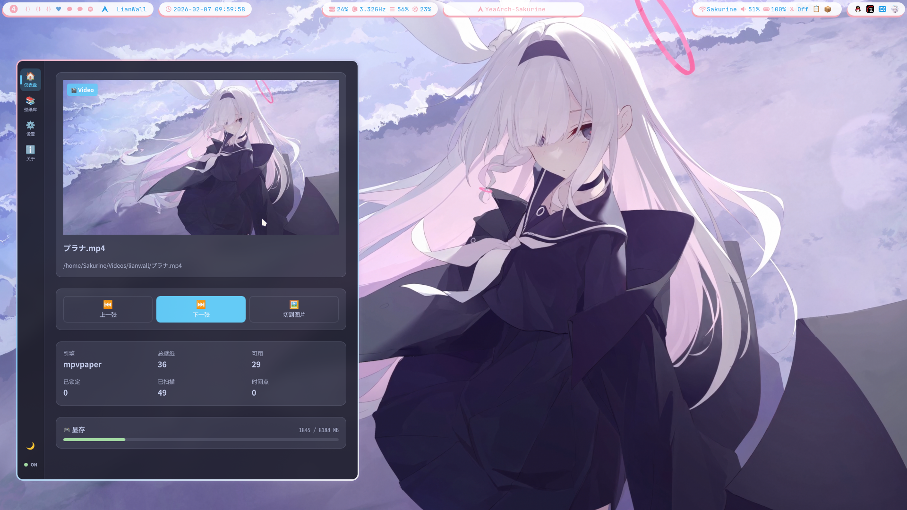
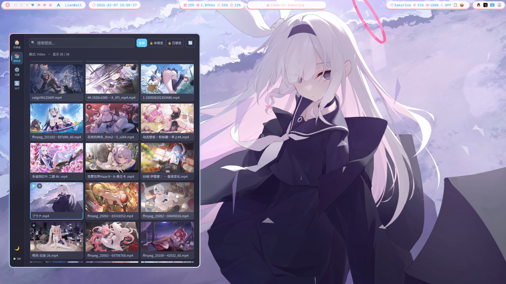
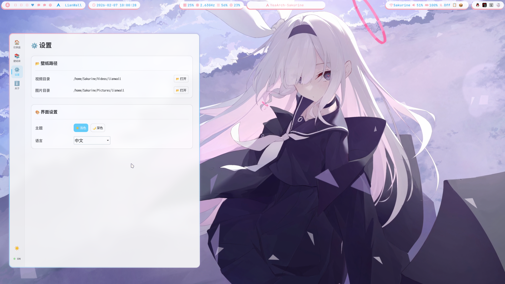
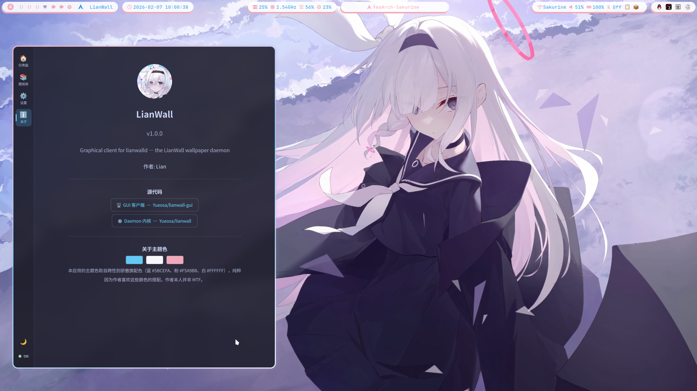

<div align="center">

# 🖼️ lianwall-gui

Qt6/QML 图形前端 — [lianwall](https://github.com/Yueosa/lianwall) 动态壁纸管理器的控制面板

[](https://github.com/Yueosa/lianwall-gui/releases)
[](LICENSE)
[](https://wayland.freedesktop.org/)
[](https://www.qt.io/)

</div>

> **lianwalld 守护进程的图形化客户端** 🎯
> - 通过 **Unix Socket** 直连 daemon，实时事件驱动
> - **仪表盘** — 当前壁纸预览、快捷操作、倒计时、显存监控
> - **壁纸库** — 网格浏览、搜索筛选、缩略图预览
> - **设置** — 完整的 daemon 配置编辑（引擎参数、VRAM、日志等）
> - **系统托盘** — 后台驻留，关闭窗口 ≠ 退出
> - **中/英双语** — 运行时切换，即时生效

**关于版本更新日志，请查看 [CHANGELOG](./CHANGELOG.md)**

---

## 📸 界面预览

| 仪表盘 | 壁纸库 |
|:------:|:------:|
|  |  |

| 设置 | 关于 |
|:----:|:----:|
|  |  |

---

## 📦 安装

### Arch Linux (AUR)

```bash
# 使用 AUR helper
paru -S lianwall-gui
# 或
yay -S lianwall-gui
```

### 手动编译

```bash
git clone https://github.com/Yueosa/lianwall-gui.git
cd lianwall-gui

cmake -B build -DCMAKE_BUILD_TYPE=Release
cmake --build build

# 安装（可选）
sudo cmake --install build
```

### 依赖

#### 运行依赖

| 包 | 说明 |
|----|------|
| Qt 6 (Core, Gui, Widgets, Quick, QuickControls2, Network) | GUI 框架 |
| ffmpeg | 视频缩略图提取 |
| [lianwall](https://github.com/Yueosa/lianwall) ≥ 5.0.0 | 守护进程 (lianwalld) |

#### 编译依赖

| 包 | 说明 |
|----|------|
| CMake ≥ 3.16 | 构建系统 |
| Qt6 开发包 | 含 LinguistTools |
| C++17 编译器 | GCC ≥ 9 / Clang ≥ 10 |

---

## 🚀 使用

```bash
# 直接运行
lianwall-gui

# 或从编译目录
./build/lianwall-gui
```

启动后 GUI 会自动连接 `lianwalld` 守护进程。如果 daemon 未运行，会自动查找并拉起（搜索顺序：`/usr/bin/lianwalld` → `~/.local/bin/lianwalld` → 同目录）。

---

## 🏠 界面

| 页面 | 功能 |
|------|------|
| **🏠 仪表盘** | 当前壁纸预览 + 状态信息 + 快捷操作 + 倒计时进度条 + 显存监控 |
| **📚 壁纸库** | 网格视图浏览壁纸，搜索筛选（全部/已锁定/未锁定），点击查看详情 |
| **⚙️ 设置** | 路径与模式、动态壁纸引擎(mpvpaper)、静态壁纸引擎(swww)、显存监控(VRAM)、守护进程、界面设置 |
| **ℹ️ 关于** | 版本信息、源代码链接、主题色说明 |

---

## 🏗️ 架构

```
lianwall-gui (Qt6/QML)
    │
    ├── DaemonClient ──── Unix Socket ──── lianwalld (Rust)
    │     (QLocalSocket)    JSON V2         (/tmp/lianwall.sock)
    │
    ├── DaemonState ────── 事件订阅 ────── WallpaperChanged
    │                                       ConfigChanged
    │                                       TimeInfo
    │
    ├── ConfigManager ──── GetConfig/SetConfig
    │     (Q_PROPERTY)      + QSettings (本地 GUI 设置)
    │
    └── WallpaperListModel + ThumbnailProvider
          (QAbstractListModel)  (ffmpeg + 磁盘缓存)
```

---

## ⚙️ 配置

### Daemon 配置

通过设置页或 `lianwall config` 命令管理，存储在 `~/.config/lianwall/config.toml`。

### GUI 本地设置

存储在 QSettings 默认位置：

| 设置 | 说明 | 默认值 |
|------|------|--------|
| `app/theme` | 界面主题 (`lian` / `lian-dark`) | `lian` |
| `app/language` | 界面语言 (`zh_CN` / `en`) | `zh_CN` |

---

## 🎨 主题色

主题色取自跨性别骄傲旗配色，纯粹因为作者喜欢这些颜色：

| 色彩 | 色值 | 用途 |
|------|------|------|
| 🔵 Blue | `#5BCEFA` | 强调色 — 按钮、链接、高亮 |
| 🩷 Pink | `#F5A9B8` | 主色 — 重要元素、选中状态 |
| ⚪ White | `#FFFFFF` | 亮面 — 反差、高亮 |

---

## 📄 许可证

LianWall License — 详见 [LICENSE](LICENSE) 文件

自由使用、修改、分发，但未经作者同意不得用于商业盈利。

## 👤 作者

**Lian** ([Yueosa](https://github.com/Yueosa))
